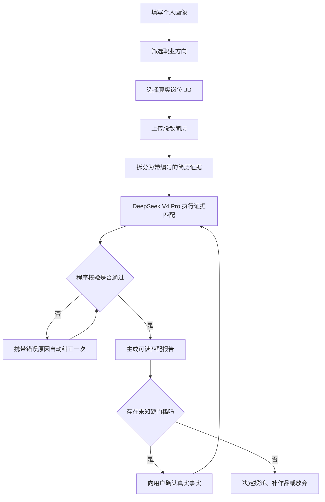

# CareerPilot 产品需求文档（PRD v0.1）

状态：已通过首位用户确认（2026-08-15）
目标用户：对职业方向迷茫、缺少技术背景的大学生
首位真实用户：金融学本科生，目标城市为青岛、上海、北京

## 1. 用户问题

大学生在求职时通常面对三个相互关联的问题：

1. 不清楚自己适合哪些岗位，只能根据专业名称或热门岗位盲目选择。
2. 看完 JD 后不知道哪些是硬门槛、哪些是偏好，也不知道自己的简历是否有证据支持。
3. 通用 AI 容易给出听起来合理但无法追溯的建议，甚至暗示用户拥有未提供的经历。

## 2. 产品目标

CareerPilot 帮助用户完成一条可验证的求职决策链：

`个人画像 → 真实岗位 → JD 结构化 → 简历证据匹配 → 缺口行动 → 投递记录`

产品不是职业测评，也不承诺录用概率。核心价值是减少盲目投递，并让每条建议能追溯到个人资料、简历或岗位原文。

## 3. MVP 用户流程

1. 用户填写专业、毕业年份、目标城市、能力自评和实习时间。
2. 系统给出 2～3 个职业探索方向及理由。
3. 系统读取人工核验过的真实 JD。
4. 用户上传脱敏简历，系统拆成带编号的证据条目。
5. 模型比较 JD 与简历，输出硬门槛、优势、证据缺口和行动建议。
6. 程序校验所有证据引用；不合格结果自动退回模型修正。
7. 用户确认事实后，决定是否投递以及需要补什么作品。

## 4. 当前已实现功能

- 离线职业方向评分与 7 天验证任务。
- 11 条真实岗位种子数据和统一 JD 字段。
- DeepSeek V4 Pro 结构化 JD 分析。
- 脱敏 DOCX 简历读取、文本框解析、去重和证据编号。
- 简历—JD 匹配及 `resume.R001` 形式的证据引用。
- 硬门槛、非法证据编号、确定性负面推断和不可靠量化建议校验。
- 模型输出校验失败后自动纠正一次。

## 5. 功能需求与验收标准

### FR-1 个人画像

系统应保存专业、学历、毕业年份、目标城市、能力自评和真实到岗条件。

验收标准：字段缺失或类型错误时给出中文错误信息；API Key 和真实简历不得进入 Git。

### FR-2 简历证据化

系统应从脱敏 DOCX 中提取教育、实习、项目和技能文本，并分配稳定证据编号。

验收标准：证件照、姓名、电话、邮箱不进入证据 JSON；重复文本被去除；文本框内容可以读取。

### FR-3 岗位匹配

系统应输出匹配结论、硬门槛、要求匹配、优势、缺口、简历调整建议、面试题和下一步行动。

验收标准：每项优势同时引用 JD 与简历证据；不存在的证据编号会被拒绝；缺少证据不能写成确定的能力不足。

### FR-4 人工确认

系统应把模型无法判断的事实交给用户确认，而不是自动假设。

验收标准：到岗时间等未知硬门槛显示为 `unknown`；用户确认后才更新为 `met`。

## 6. 暂不实现

- 自动投递岗位。
- 未经确认自动修改正式简历。
- 抓取或保存身份证号、家庭住址等敏感信息。
- 给出“录用概率”或替代用户做最终职业决定。

## 7. 成功指标

- 证据引用合法率：100%。
- 已知硬门槛判断正确率：100%。
- 评测集中不出现虚构候选人经历。
- 用户能在 10 分钟内理解“为什么匹配、为什么不匹配、下一步做什么”。
- MVP 至少支持 10 个真实岗位评测案例。

## 8. 下一版本任务

1. 为本 PRD 补一张核心用户流程图。
2. 实现岗位匹配结果的可读 Markdown 报告生成器。
3. 建立 10 个包含坏案例的自动评测样本。
4. 完成一个最小 RAG 学习项目，理解检索、上下文和生成的边界。
5. 最后再制作网页界面和可演示原型。
