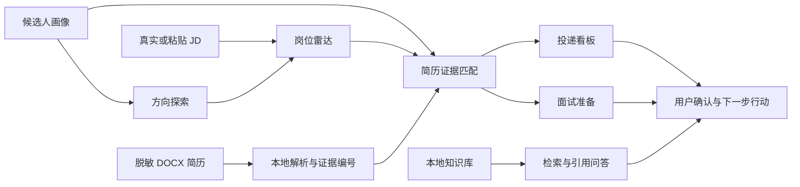
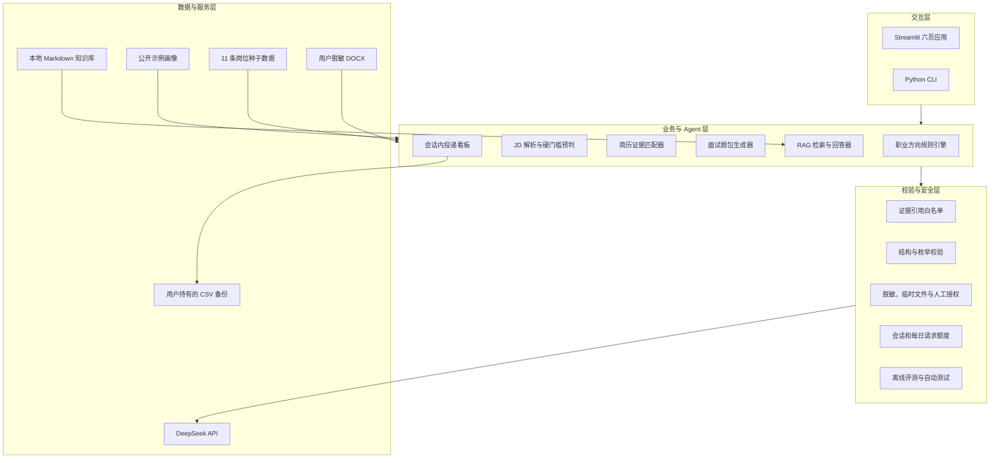
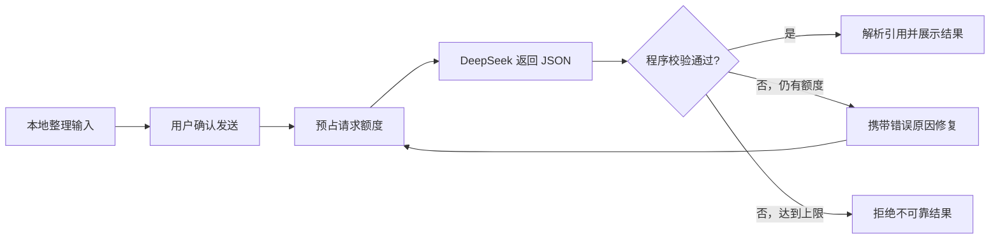

# CareerPilot 作品集说明

> 一句话介绍：CareerPilot 是一个面向应届生的证据型求职智能体。它把候选人画像、真实岗位要求、脱敏简历和知识库原文连接起来，在不编造经历的前提下给出可追踪、可校验的求职建议。

- 在线演示：[career-pilot-xiaoyu.streamlit.app](https://career-pilot-xiaoyu.streamlit.app/)
- 项目源码：[github.com/hoducc673-source/career-pilot](https://github.com/hoducc673-source/career-pilot)
- 当前模型：DeepSeek V4 Pro，关闭思考模式，要求结构化 JSON 输出

## 1. 为什么做这个项目

应届生使用通用大模型求职时，常见问题不是“答案不够流畅”，而是：

1. 不知道自己适合哪些方向，容易被单次聊天结论带偏；
2. JD、简历和建议之间缺乏证据关联；
3. 模型可能把“简历写过某工具”夸大为“熟练掌握”；
4. 上传简历、保存投递记录和调用付费 API 都有隐私或成本风险。

CareerPilot 因此不追求替用户做决定，而是先定位证据，再让用户确认和行动。

## 2. 产品流程

网页版包含六个页面：

| 页面 | 解决的问题 | 是否调用模型 |
| --- | --- | --- |
| 方向探索 | 根据画像透明排序候选方向 | 否 |
| 岗位雷达 | 浏览真实样本或本地解析粘贴 JD | 否 |
| 简历匹配 | 对照 JD 判断硬门槛、优势与证据缺口 | 用户确认后调用 |
| 投递看板 | 管理投递状态、截止日期和下一步行动 | 否 |
| 面试准备 | 基于 JD 与简历证据生成问题和回答结构 | 用户确认后调用 |
| 知识问答 | 先检索本地资料，再生成带引用回答 | 检索免费，生成可选 |

## 3. 系统架构

一次需要模型的任务不是简单地“把文本发给大模型”，而是一个受约束的循环：

## 4. 关键技术决策

### 4.1 先由程序判断客观硬门槛

学历、毕业年份、每周到岗天数、连续实习月份和强制证书等规则先由 Python 判断，再将结果交给模型原样引用。这样可以减少模型在确定性条件上的自由发挥。

### 4.2 模型结论必须绑定真实证据

- 简历证据使用 `resume.R001` 形式的稳定编号；
- 岗位证据使用 `job.requirements[0]` 等字段路径；
- RAG 回答使用稳定片段编号，例如 `[KXXXXXXXXXX]`；
- 程序拒绝不存在的引用、缺少引用的结论和证据不平衡的结果。

### 4.3 不把“没看到证据”写成“候选人不会”

系统把缺失证据标记为 `unknown`，只描述当前材料中的空白，并给出补证或学习行动。技能栏只能证明“列出了工具”，不能自动推导为“熟练、精通或擅长”。

### 4.4 隐私优先于方便

- 简历要求用户先脱敏，并只在临时目录解析；
- 发送模型前展示文本预览并要求主动勾选；
- 公开投递看板不使用共享数据库，数据只留在浏览器会话；
- 用户通过 CSV 自己备份，导出时中和电子表格公式注入风险；
- API Key 仅通过本地环境变量或 Streamlit Secrets 配置。

### 4.5 公开演示设置成本上限

默认每个浏览器会话最多 3 次、单个服务进程每天最多 12 次模型请求。自动修复也计入次数；没有 API Key 或额度耗尽时，离线功能仍然可用。

## 5. 可验证结果

- 6 个完整网页页面；
- 11 条结构化真实岗位样本；
- RAG 固定评测集 11/11 通过；
- 75 项自动化测试通过；
- 简历匹配、RAG 回答和面试题包均包含程序级输出校验与最多两次自动修复；
- 已部署公开演示，并使用真实 DeepSeek V4 Pro 完成接口契约验证。

这些数字描述的是当前仓库中的固定样本和测试结果，不代表对所有岗位或问题的泛化准确率。

## 6. 我的角色与学习收获

这个项目是在 AI 编程辅助下完成的个人项目。我的核心工作包括：

- 从自己的求职困惑出发定义目标用户、需求边界和验收标准；
- 选择“证据优先”而不是“自动生成漂亮答案”的产品路线；
- 提供并确认候选人画像、目标城市、岗位条件和隐私边界；
- 使用真实简历与岗位逐轮验收，发现模型夸大能力等问题并推动规则修正；
- 完成 GitHub、DeepSeek API、Streamlit Cloud 的配置和发布流程；
- 学习 Python、Git、命令行、结构化输出、RAG、自动评测和 Agent 安全设计。

我不会把 AI 生成的代码全部表述为自己手写。面试时会重点说明我如何定义问题、验证输出、发现风险并推动产品迭代，同时继续补足独立编码能力。

## 7. 当前局限

- 岗位样本量仍小，不能代表完整就业市场；
- RAG 当前使用可解释的关键词与 IDF 检索，不是向量数据库；
- 每日额度计数是单进程内存计数，服务重启后会重置；
- 公开版本没有账号系统，因此投递记录不能跨设备自动同步；
- 模型结果即使通过格式和引用校验，也仍需用户人工判断内容是否合理。

## 8. 简历项目描述

### 两行精简版

**CareerPilot｜证据型求职智能体｜个人项目**  
基于 Python、Streamlit 与 DeepSeek V4 Pro，搭建覆盖方向探索、JD 解析、脱敏简历匹配、RAG 问答、投递管理和面试训练的求职 Agent；通过证据引用白名单、结构校验、隐私确认和请求额度保护降低模型编造、数据泄露与成本失控风险。

### 三点成果版

- 从个人求职场景出发定义并上线 CareerPilot，形成“画像—岗位—简历证据—行动建议”的六页产品闭环，支持公开在线演示；
- 设计简历与 JD 的证据编号和程序校验机制，拦截不存在的引用、未经证实的能力强度和虚构经历，并为不合格模型输出提供最多两次自动修复；
- 搭建本地关键词与 IDF RAG 检索基线，在 11 个固定检索案例中达到 11/11，通过 75 项自动化测试，并增加脱敏授权、CSV 隐私存储和 API 用量保护。

### 面试时的诚实表述

“这是我在 AI 编程辅助下完成的第一个完整 Agent 项目。我不把重点放在代码量，而是放在产品问题、证据约束和验证闭环。我用自己的求职需求做真实用户测试，发现模型会把技能清单夸大成熟练能力，于是把这类风险转成程序规则和自动测试。这个过程让我理解了 Agent 不只是调用大模型，还需要数据、工具、状态、评测、隐私和人工确认。”

